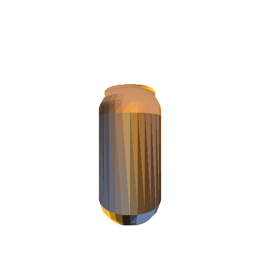
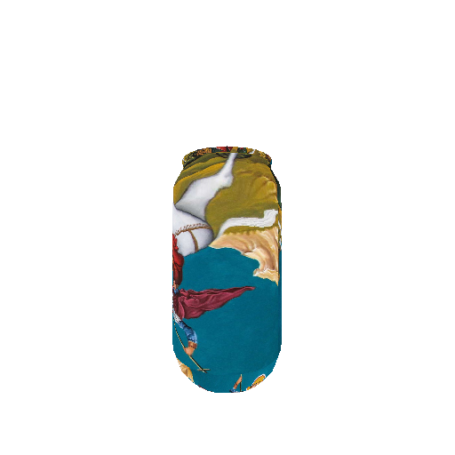

# Computer Graphics Exercises

This project was developed as part of the course **"Computer Graphics"**, part of the 2024–25 syllabus for the School of Electrical and Computer Engineering, Aristotle University of Thessaloniki.

Each directory corresponds to an individual exercise and can be executed independently by running the respective `demo.py` files. Combined, the exercises form the foundation of a complete 2D graphics rendering pipeline.

[1) Triangle Rasterizer](#-triangle-rasterizer)

---

# 🟦 Exercise 1 - Triangle Rasterizer

This module implements a basic triangle rasterizer from scratch in Python, supporting both **flat shading** and **texture shading**. The renderer takes as input triangle geometry and vertex attributes and outputs shaded images by scanline-filling triangles in image space.

## 📸 Output Examples

<table>
<tr>
<td align="center">
  <br/>
  <strong>Flat shading</strong>
</td>
<td align="center">
  <br/>
  <strong>Texture shading</strong>
</td>
</tr>
</table>

---

## 🧠 Features

- ✅ Linear interpolation of vertex attributes (position, color, UV)
- ✅ Scanline triangle filling
- ✅ Flat shading (uniform per-triangle color)
- ✅ Texture mapping via interpolated UV coordinates
- ✅ Triangle depth sorting using painter’s algorithm

---

## 🚀 How It Works

1. **Input Data**:
   - `vertices`: 2D vertex positions
   - `vcolors`: RGB colors per vertex (for flat shading)
   - `uv`: texture coordinates (for texture shading)
   - `depth`: z-values per vertex

2. **Preprocessing**:
   - Faces are converted to triangle descriptors with vertex data and average depth.
   - Triangles are sorted in back-to-front order.

3. **Rendering**:
   - For each triangle, depending on the selected shading method (`"f"` or `"t"`), a scanline algorithm fills pixels and assigns colors.
   - UV-to-texture-space mapping is applied in texture mode.

---

## 📦 Requirements

- Python 3.8+
- NumPy
- OpenCV (for image loading, resizing, and saving)

Install dependencies with:

```bash
pip install -r requirements.txt
