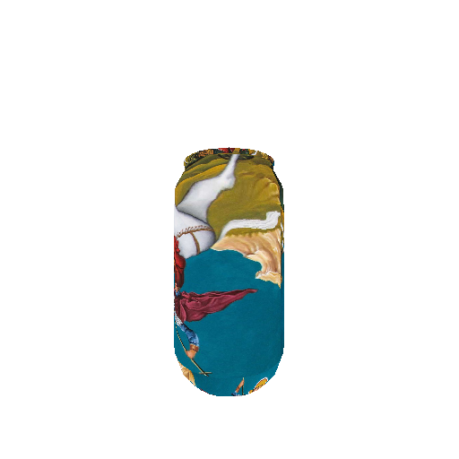
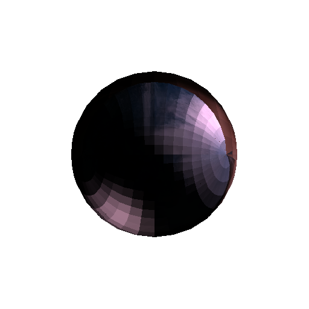

# Computer Graphics – Course Exercises (AUTh 2024–2025)

This repository contains my exercises for the course **Computer Graphics** at the Department of Electrical and Computer Engineering, Aristotle University of Thessaloniki (AUTh), academic year 2024–2025.

All algorithms are implemented **from scratch**, with an emphasis on understanding the underlying principles of 3D rendering, lighting models, and rasterization techniques. The repository includes triangle rasterization, camera transformations, perspective projection, and physically-based lighting.

## Implemented Methods

### Part 1 – Triangle Rasterization

* Shading Methods:
  * Flat Shading (uniform per-triangle color)
  * Texture Mapping (UV-based texture sampling)
* Scanline triangle filling with linear interpolation
* Painter's algorithm for depth sorting

**Results:**

<table>
<tr>
<td align="center">
  <br/>
  <strong>Flat Shading</strong>
</td>
<td align="center">
  <br/>
  <strong>Texture Mapping</strong>
</td>
</tr>
</table>

### Part 2 – 3D Object Rendering

* Camera Transformations:
  * LookAt view matrix
  * World-to-view coordinate transformation
* Perspective Projection (pinhole camera model)
* Screen-space rasterization
* Animated camera trajectories

### Part 3 – Phong Lighting Model

* Material Properties:
  * Ambient, Diffuse, and Specular coefficients
  * Shininess (Phong exponent)
* Shading Techniques:
  * Gouraud Shading (per-vertex lighting, interpolated colors)
  * Phong Shading (per-pixel lighting, interpolated normals)
* Vertex normal calculation from triangle mesh
* Multiple light sources support

**Results:**

<table>
<tr>
<td align="center">
  <br/>
  <strong>Gouraud Shading</strong>
</td>
<td align="center">
  <br/>
  <strong>Phong Shading</strong>
</td>
</tr>
</table>

## Installation & Requirements

You can easily replicate the environment using **uv**:

```bash
uv sync
```

## Running the Code

Each demo can be executed as a module or directly:

```bash
# Part 1 - Triangle Rasterization
uv run src/part1/demo_f.py  # Flat shading
uv run src/part1/demo_g.py  # Texture mapping

# Part 2 - 3D Object Rendering
uv run src/part2/demo1.py   # Forward-looking camera
uv run src/part2/demo2.py   # Target-looking camera

# Part 3 - Phong Lighting
uv run src/part3/demo.py    # Generates 8 images (2 shaders × 4 lighting modes)
```

Detailed execution instructions and experiment descriptions are provided in each part's `docs/` directory.

## Running the Tests

All tests are written using **pytest**. To run the tests for any part:

```bash
# Run all tests
uv run pytest

# Run tests for specific part
uv run pytest tests/part1/ -v
uv run pytest tests/part2/ -v
uv run pytest tests/part3/ -v
```

## Project Structure

```
computer-graphics/
├── src/
│   ├── part1/          # Triangle rasterization
│   ├── part2/          # 3D rendering pipeline
│   └── part3/          # Phong lighting model
├── tests/
│   ├── part1/          # Unit tests for part 1
│   ├── part2/          # Unit tests for part 2
│   └── part3/          # Unit tests for part 3
├── docs/
│   ├── part1/          # Assignment specs and reports
│   ├── part2/
│   └── part3/
└── outputs/
    ├── part1/          # Rendered images
    ├── part2/
    └── part3/
```
